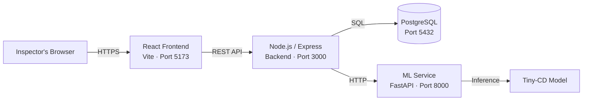

# Building Change Detection System

An AI-powered web application for detecting structural changes in buildings by comparing inspection images over time. Inspectors upload two images of the same building (taken at different times), and a machine-learning model highlights areas where changes have occurred — cracks, structural shifts, new additions, or deterioration.

## Architecture



**Data flow:** The inspector logs in, uploads two images via the React frontend. The backend stores metadata in PostgreSQL and forwards the images to the ML service, which runs change-detection inference and returns bounding boxes of detected changes. The backend saves the results and the frontend renders them visually.

## Tech Stack

| Layer       | Technology           | Purpose                              |
|-------------|----------------------|--------------------------------------|
| Frontend    | React 18, Vite, JS   | Single-page application UI           |
| Backend     | Node.js, Express     | REST API, authentication, file mgmt  |
| Database    | PostgreSQL 16        | Inspection data, user accounts        |
| ML Service  | Python, FastAPI      | Change-detection inference (Tiny-CD) |
| Dev Tools   | Docker Compose       | Local database provisioning (optional)|

## Quick Start

### Prerequisites

- Node.js 18+ and npm
- Python 3.10+
- PostgreSQL 16 (local install, Docker, or a free cloud service like [Neon](https://neon.tech) / [Supabase](https://supabase.com))

### 1. Start the backend

```bash
cd backend
cp .env.example .env         # Edit if needed
npm install
npm run dev                  # Runs on http://localhost:3000
```

> The backend starts without a database connection — all endpoints return 501 at this stage. You'll configure the DB later when you start implementing real features.

### 2. Start the frontend

```bash
cd frontend
cp .env.example .env         # Edit if needed
npm install
npm run dev                  # Runs on http://localhost:5173
```

### 3. Start the ML service

```bash
cd ml-service
python -m venv .venv
source .venv/bin/activate    # On Windows: .venv\Scripts\activate
pip install -r requirements.txt
uvicorn app:app --reload --port 8000
```

### Optional: Database with Docker

If you have Docker installed, you can spin up PostgreSQL + Adminer with one command:

```bash
cp .env.example .env        # Edit with your preferred credentials
docker compose up -d         # Starts PostgreSQL + Adminer
```

Adminer (DB browser) will be available at `http://localhost:8080`.

If you prefer to install PostgreSQL directly or use a cloud instance, create a database manually and run `database/001_initial_schema.sql` against it.

## Project Structure

```
BuildingChangeDetection/
├── frontend/           # React SPA (Vite)
│   ├── src/
│   │   ├── components/ # Reusable UI components
│   │   ├── pages/      # Route-level page components
│   │   └── styles/     # CSS files
│   └── ...
├── backend/            # Express REST API
│   ├── src/
│   │   ├── routes/     # Route handlers grouped by domain
│   │   ├── middleware/  # Auth, error handling, etc.
│   │   └── config/     # DB pool, environment config
│   └── ...
├── ml-service/         # FastAPI ML inference service
├── database/           # SQL migrations and seed scripts
├── docs/               # Architecture docs, API spec
└── docker-compose.yml  # Local development infrastructure
```

## Team

| Role               | Name                       |
|--------------------|----------------------------|
| Supervisor         | Dr. Kiril Vasilchenko      |
| Frontend Developer | Neta Goolzad               |
| Backend / ML       | Yair Katsav                |

## Academic Context

This project is a **Capstone Project (2025–2026)** at the **Holon Institute of Technology (HIT)**, Department of Information Systems.

### Key Documents

- [Initiation Document](#) — *link TBD*
- [Product Requirements Document (PRD)](#) — *link TBD*

> Students: the PRD is your source of truth for feature requirements. When in doubt about what to build, consult the PRD first, then ask the supervisor.
