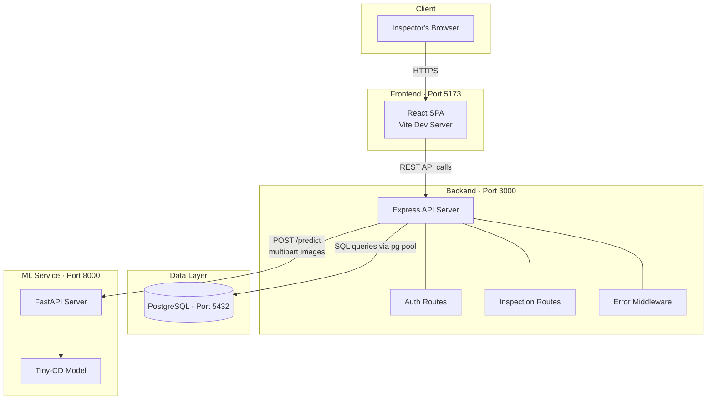

# System Architecture

## Overview

The system follows a standard three-tier web architecture with a separate ML inference service. Each component runs as an independent process, communicating over HTTP/REST.

## Component Details

### Frontend (React + Vite)

- **Role:** User interface for inspectors
- **Key pages:** Login, Upload, Processing, Results, History, Help
- **Communication:** Calls the backend API via Axios; never talks to the DB or ML service directly
- **Runs on:** `http://localhost:5173` (Vite dev server)

### Backend (Node.js + Express)

- **Role:** Business logic, authentication, file management, orchestration
- **Responsibilities:**
  - Authenticate users (JWT)
  - Accept image uploads and store metadata
  - Forward image pairs to the ML service for inference
  - Save and retrieve inspection results
- **Runs on:** `http://localhost:3000`

### Database (PostgreSQL 16)

- **Role:** Persistent storage for users, inspections, and results
- **Managed via:** Docker Compose (development), managed service in production
- **Schema:** See `database/001_initial_schema.sql`

### ML Service (Python + FastAPI)

- **Role:** Run change-detection inference on image pairs
- **Model:** Tiny-CD (a lightweight change-detection architecture)
- **Input:** Two images (before/after) via multipart form data
- **Output:** JSON with detected changes and bounding boxes
- **Runs on:** `http://localhost:8000`

## Design Decisions

<!-- TODO: Students should document key decisions here as the project evolves -->
<!-- Examples: Why JWT over sessions? Why separate ML service? Why PostgreSQL over MongoDB? -->

> Document your architectural decisions here as you make them. For each decision, note: what you decided, what alternatives you considered, and why you chose this approach.
